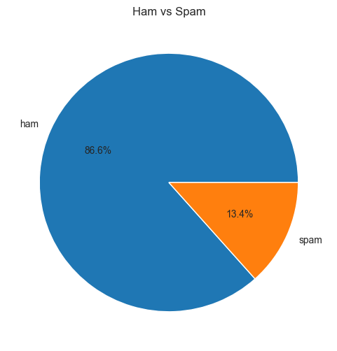

<div align="center">

# SMS Spam Detector
### NLP-Powered Message Classification Pipeline


<br />

**[ Explore the Code ](ham_or_spam.ipynb) • [ View the Data ](data/sms_spam.csv) • [ Report Bug ](issues)**

</div>

---

## Project Overview
**SMS Spam Detector** is a Machine Learning project designed to automatically filter and classify mobile text messages.

Unwanted messages are not just a nuisance; they are a security risk. This project leverages Natural Language Processing (NLP) to translate raw text into numerical features and builds a predictive model to distinguish between legitimate messages (**Ham**) and unsolicited content (**Spam**).

## Repository Contents
* **`sms_spam_classifier.py`**: The main script containing the analysis pipeline: data loading, vectorization, and model training.
* **`sms_spam.csv`**: The dataset containing thousands of labeled SMS messages.
* **`sms_type_pie_chart.png`**: Visualization of the class distribution.
* **`README.md`**: Project documentation.

## The Data "Story"
The dataset represents a classic text classification problem. The key challenge lies in the unstructured nature of text and the class imbalance. Key features include:

* **The Text:** Raw SMS content containing slang, abbreviations, and symbols.
* **The Label:** `ham` (legitimate) or `spam` (unsolicited).
* **The Imbalance:** The dataset is heavily skewed towards legitimate messages (~87%), requiring careful model evaluation.

## Visual Insights
*Understanding the balance of data is key to model performance.* We emphasize data exploration through visualization. We use a **Pie Chart** to inspect the proportion of spam vs. ham messages. This visualization highlights the class imbalance, which informs our choice of evaluation metrics and splitting strategies.

> 
>
> *Figure 1: Distribution of SMS types showing the prevalence of Ham over Spam.*

## Tech Stack & Methods

| Component | Technology | Description |
| :--- | :--- | :--- |
| **Data Processing** | Pandas | Loading CSV, Data Inspection (`value_counts`) |
| **Visualization** | Matplotlib | Custom Pie Chart to visualize Class Distribution |
| **NLP / Preprocessing** | Scikit-Learn | `TfidfVectorizer` (Bag of Words technique) |
| **Modeling** | Scikit-Learn | **Logistic Regression** for binary classification |
| **Evaluation** | Scikit-Learn | `accuracy_score` on Train/Test splits |

##  How to Run
To replicate this analysis on your local machine:

1.  **Clone the repository:**
    ```bash
    git clone [https://github.com/marta23-10/easy-spam-ham-classification.git](https://github.com/marta23-10/easy-spam-ham-classification.git)
    cd easy-spam-ham-classification
    ```
2.  **Install required libraries:**
    ```bash
    pip install pandas matplotlib scikit-learn
    ```
3.  **Run the script:**
    ```bash
    python ham_or_spam.ipynb
    ```

##  Project Roadmap
This project follows a structured data science lifecycle:

- [x] **Phase 1: Data Ingestion & Cleaning**
    - Loading the `sms_spam.csv` dataset.
    - Handling basic text structure.
- [x] **Phase 2: Exploratory Data Analysis (EDA)**
    - visualizing class distribution with Matplotlib.
    - Identifying the "Ham" vs "Spam" ratio.
- [x] **Phase 3: Preprocessing**
    - Converting text to numbers using `TfidfVectorizer`.
    - Splitting data into Training and Testing sets with stratification.
- [x] **Phase 4: Predictive Modeling**
    - Training a **Logistic Regression** model.
    - Evaluating performance (Accuracy Score).

##  Contributing
Contributions are welcome! If you have ideas for better text preprocessing or new models:
1.  Fork the repo.
2.  Create your feature branch.
3.  Submit a Pull Request.

---
<div align="center">
    <p><i>Created with Python & Scikit-Learn</i></p>
</div>
